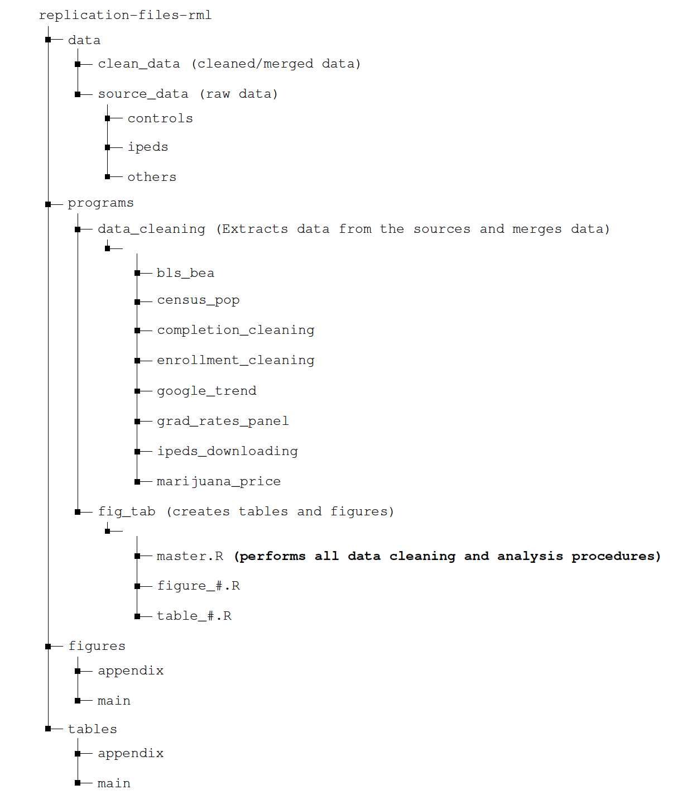

### Overview

The code in this replication package installs all necessary commands and runs all the analyses for the paper " From High School to Higher Education: Is recreational marijuana a consumption amenity for US college students?" by Ahmed El Fatmaoui. All analysis is done in R. A parent file(master.R) can be used to run all filesat once, calling other scripts to install and load required packages and create tables and figures. master.R script code saves tables in tables folder and figuresin figuresfolder. To replicate a single table or figure,run only the source named after that table or figure(e.g., run source("table\_A7.R") to replicate table A7). Replicators can expect the code to take about 1 hour to run. Mainly, replication of figure6 and table A9 takes a longer time to run as it computes the distance between each college location and the closest treated state border.

Figure 1: Layout of Replication Files

replication-files-rml data

Figure[ 1 ](#_page0_x72.00_y269.75)illustrates the layout of the replication files. The data folder encompasses two primary subfolders. One folder (source\_data) houses the raw data obtained from [National Center for Education Statistics (2022a) ](#_page8_x47.09_y242.74)or other sources [(Bureau of Labor Statistics, 2021,](#_page8_x47.09_y143.10)[ Bureau of Economic Analysis,](#_page8_x47.09_y103.24) [2021,](#_page8_x47.09_y103.24) [U.S. Census Bureau,](#_page8_x47.09_y362.32) [2021).](#_page8_x47.09_y362.32) The other folder contains the processed data, specificallythe merged IPEDS data.

Similarly, the programs folder, which comprises all the R scripts, includes a subfolder (data\_cleaning) responsible for downloading and cleaning the data. Another subfolder (fig\_tab) within the programs folder executes all analyses. The latter saves figuresand tables in their respective folders located within the last two major folders illustrated in Figure[ 1.](#_page0_x72.00_y269.75)

### Data Availability and Provenance Statements

The paper uses mainly IPEDS data[ National Center for Education Statistics (2022a](#_page8_x47.09_y242.74)), and two other data from[ Bureau of Economic Analysis (2021)](#_page8_x47.09_y103.24)[^1][,](#_page0_x0.00_y792.00) [Bureau of Labor Statistics (2021),](#_page8_x47.09_y143.10) and [U.S. Census Bureau (2021).](#_page8_x47.09_y362.32) Other data used in appendix are from Google Trends and priceofweed.com. See section 3 and appendix B for detailed description of these data. I certify that the author(s) of the manuscript have legitimate access to and permission to use, redistribute, and publish the data used in this manuscript. All data are publicly available and have been deposited in the ICPSR repository of this paper.

Dataset List

Table 1: Table 1: datasets Used in Paper

|Dataset|Data files|Description and processing|DataLocation|Citation|Provided|
| - | - | - | - | - | - |
|IPEDS: Fall Enrollment|enroll\_main.csv, enroll\_all.csv, enroll\_vocational.csv|
Data source [(Link):](https://nces.ed.gov/ipeds/datacenter/DataFiles.aspx?gotoReportId=7&fromIpeds=true&sid=ac68b949-876c-439b-abf0-e431b89449a2&rtid=1)

- IPEDs Survey: Fall Enrollment

- IPEDs Title: Race/ethnicity, gender, attendance status, and level of student: Fall (2009-2019).

Data Processing

- data\_cleaning/ipeds\_downloading/IPEDS\_scraping.R downloads the data.

- data\_cleaning/enrollment\_cleaning/enroll\_cleaning.R merges the data together and saves for vocational (enroll\_vocational), academic (enroll\_main) and all institutions (enroll\_all).
|&emsp;data/clean\_data|&emsp;[National Center for Educa- tion Statistics (2022a)](#_page8_x47.09_y242.74)|&emsp;TRUE|
|IPEDS—|grad\_rates.csv|Data source [(Link):](https://nces.ed.gov/ipeds/datacenter/MasterVariableList.aspx?cFrom=ADDVARIABLE&sid=ac68b949-876c-439b-abf0-e431b89449a2&rtid=1)|data/clean\_data|[National Center](#_page8_x47.09_y302.53)|TRUE|
|Graduation||- The link will navigate you to the dataset detailing graduation||[for Educa-](#_page8_x47.09_y302.53)||
|rates||rates over 4, 5, and 6-year periods. Click ‘Continue’ as required||[tion Statistics](#_page8_x47.09_y302.53)||
|||until the data is successfully downloaded to your local machine||[(2022b)](#_page8_x47.09_y302.53)||
|||(data/source\_data/ipeds/gradrateraw.csv).||||
|||Data Processing||||
|||- data\_cleaning/grad\_rates\_panel/gradratespanel.R mergesthedata||||
|||together.||||
|IPEDS—|completion.csv|Data source [(Link):](https://nces.ed.gov/ipeds/datacenter/DataFiles.aspx?gotoReportId=7&fromIpeds=true&sid=ac68b949-876c-439b-abf0-e431b89449a2&rtid=1)|data/clean\_data|[National Center](#_page8_x47.09_y242.74)|TRUE|
|Completion||- IPEDs Survey: Completions||[for Educa-](#_page8_x47.09_y242.74)||
|||- IPEDs Title: Awards/degrees conferred by program (6-digit CIP||[tion Statistics](#_page8_x47.09_y242.74)||
|||code), award level, race/ethnicity, and gender: (2009-2019).||[(2022a)](#_page8_x47.09_y242.74)||
|||Data Processing||||
|||- data\_cleaning/ipeds\_downloading/IPEDS\_scraping.R downloads||||
|||the data.||||
|||- data\_cleaning/completion\_cleaning/compl\_cleaning.R merges the||||
|||data together.||||
|PEDS— Tu-|welfare.csv|Data source [(Link):](https://nces.ed.gov/ipeds/datacenter/DataFiles.aspx?gotoReportId=7&fromIpeds=true&sid=ac68b949-876c-439b-abf0-e431b89449a2&rtid=1)|data/clean\_data|[National Center](#_page8_x47.09_y242.74)|TRUE|
|ition revenue||||[for Educa-](#_page8_x47.09_y242.74)||
|and retention||1) Tuition revenue||[tion Statistics](#_page8_x47.09_y242.74)||
|rates||- IPEDs Survey: Finance||[(2022a)](#_page8_x47.09_y242.74)||
|||- IPEDs Title: all of the financesurveys (2009-2019)||||
|||2) Retention rates||||
|||- IPEDs Survey: Fall Enrollment||||
|||- IPEDs Title: Race/ethnicity, gender, attendance status, and level of||||
|||student: Fall (2009-2019)||||
|||Data Processing||||
|||- data\_cleaning/ipeds\_downloading/IPEDS\_scraping.R downloads||||
|||the data.||||
|||- data\_cleaning/enrollment\_cleaning/welfare\_cleaning.R merges the||||
|||data together.||||
|IPEDS—|adm.csv|Data source [(Link):](https://nces.ed.gov/ipeds/datacenter/DataFiles.aspx?gotoReportId=7&fromIpeds=true&sid=ac68b949-876c-439b-abf0-e431b89449a2&rtid=1)|data/clean\_data|[National Center](#_page8_x47.09_y242.74)|TRUE|
|Admission||||[for Educa-](#_page8_x47.09_y242.74)||
|and test||- IPEDs Survey: Admissions and Test Scores||[tion Statistics](#_page8_x47.09_y242.74)||
|scores||- IPEDs Title: Admission considerations, applications, admissions,||[(2022a)](#_page8_x47.09_y242.74)||
|||enrollees and test scores, fall (2009-2019)||||
|||Data Processing||||
|||- data\_cleaning/ipeds\_downloading/IPEDS\_scraping.R downloads||||
|||the data.||||
|IPEDS—|resid\_first\_enrol.csv|Data source [(Link):](https://nces.ed.gov/ipeds/datacenter/DataFiles.aspx?gotoReportId=7&fromIpeds=true&sid=ac68b949-876c-439b-abf0-e431b89449a2&rtid=1)|data/source\_data/ipeds|[National Center](#_page8_x47.09_y242.74)|TRUE|
|Fall En-||||[for Educa-](#_page8_x47.09_y242.74)||
|rollment,||- IPEDs Survey: Fall Enrollment||[tion Statistics](#_page8_x47.09_y242.74)||
|residency||- IPEDs Title: Residence and migration of first-timefreshman: Fall||[(2022a)](#_page8_x47.09_y242.74)||
|||(2009-2019)||||
|||Data Processing||||
|||- data\_cleaning/ipeds\_downloading/IPEDS\_scraping.R downloads||||
|||the data.||||
|IPEDS— Fi-|finance\_all.csv|Data source [(Link):](https://nces.ed.gov/ipeds/datacenter/DataFiles.aspx?gotoReportId=7&fromIpeds=true&sid=ac68b949-876c-439b-abf0-e431b89449a2&rtid=1)|data/source\_data/ipeds|[National Center](#_page8_x47.09_y242.74)|TRUE|
|nance|finance\_fasb.csv|||[for Educa-](#_page8_x47.09_y242.74)||
||finance\_gasp.csv|- All Finance surveys except "Response status for all survey compo-||[tion Statistics](#_page8_x47.09_y242.74)||
||finance\_private.csv|nents" from 2009 to 2019||[(2022a)](#_page8_x47.09_y242.74)||
||finance\_public.csv|Data Processing||||
|||- data\_cleaning/ipeds\_downloading/IPEDS\_scraping.R downloads||||
|||the data.||||
|IPEDS—|df\_inst\_char.csv|Data source [(Link):](https://nces.ed.gov/ipeds/datacenter/DataFiles.aspx?gotoReportId=7&fromIpeds=true&sid=ac68b949-876c-439b-abf0-e431b89449a2&rtid=1)|data/source\_data/ipeds|[National Center](#_page8_x47.09_y242.74)|TRUE|
|Institutional|df\_inst\_char2.csv|||[for Educa-](#_page8_x47.09_y242.74)||
|Characteris-|df\_inst\_char3.csv|- IPEDs Survey: Institutional Characteristics||[tion Statistics](#_page8_x47.09_y242.74)||
|tics||- IPEDS Titles:||[(2022a)](#_page8_x47.09_y242.74)||
|||Directory information (2009-2019)||||
|||Educational offerings, organization, services and athletic associa-||||
|||tions (2009-2019)||||
|||Student charges for academic year programs (2009-2019)||||
|||Data Processing||||
|||- data\_cleaning/ipeds\_downloading/IPEDS\_scraping.R downloads||||
|||the data.||||
|IPEDS—|headcounts.csv|Data source [(Link):](https://nces.ed.gov/ipeds/datacenter/DataFiles.aspx?gotoReportId=7&fromIpeds=true&sid=ac68b949-876c-439b-abf0-e431b89449a2&rtid=1)|data/source\_data/ipeds|[National Center](#_page8_x47.09_y242.74)|TRUE|
|12-Month||||[for Educa-](#_page8_x47.09_y242.74)||
|Enrollment||- IPEDs Survey: 12-Month Enrollment||[tion Statistics](#_page8_x47.09_y242.74)||
|||- IPEDS Titles: 12-month unduplicated headcount by race/ethnicity,||[(2022a)](#_page8_x47.09_y242.74)||
|||gender and level of student:(2009-2019)||||
|||Data Processing||||
|||- data\_cleaning/ipeds\_downloading/IPEDS\_scraping.R downloads||||
|||the data.||||
|IPEDS—|quality\_measures.csv|Data source [(Link):](https://nces.ed.gov/ipeds/datacenter/DataFiles.aspx?gotoReportId=7&fromIpeds=true&sid=ac68b949-876c-439b-abf0-e431b89449a2&rtid=1)|data/source\_data/ipeds|[National Center](#_page8_x47.09_y242.74)|TRUE|
|Fall Enroll-||||[for Educa-](#_page8_x47.09_y242.74)||
|ment||- IPEDs Survey: Fall Enrollment||[tion Statistics](#_page8_x47.09_y242.74)||
|||- IPEDS Titles: Total entering class, retention rates, and student-to-||[(2022a)](#_page8_x47.09_y242.74)||
|||faculty ratio: (2009-2019)||||
|||Data Processing||||
|||- data\_cleaning/ipeds\_downloading/IPEDS\_scraping.R downloads||||
|||the data.||||
|BEA, BLS,|bls\_bea\_data.csv cen-|County level data for population, unemployment rate and per capita|data/source\_data/controls|[(Bureau of Eco-](#_page8_x47.09_y103.24)|TRUE|
|and Census|sus\_agesex.csv cen-|income from 2009 to 2019:||[nomic Analysis,](#_page8_x47.09_y103.24)||
|Data|sus\_migration.csv|||[2021,](#_page8_x47.09_y103.24)[ Bureau of](#_page8_x47.09_y143.10)||
|||BLS data source [(Link)](https://web.archive.org/web/20190831005817/https://www.bls.gov/lau)||[Labor Statistics,](#_page8_x47.09_y143.10)||
|||||[2021,](#_page8_x47.09_y143.10) [U.S.](#_page8_x47.09_y362.32)||
|||BEA data source [(Link)](https://github.com/us-bea/bea.R)||[Census Bureau,](#_page8_x47.09_y362.32)||
|||||[2021)](#_page8_x47.09_y362.32)||
|||Census data source [(Link)](https://www2.census.gov/programs-surveys/popest/datasets/)||||
|||Data Processing||||
|||- data\_cleaning/census\_pop/census\_data.R downloads the census||||
|||data.||||
|||- data\_cleaning/bls\_bea/scraping\_functions.R downloads the BLS||||
|||and BEA data.||||
|Other Data|WeedPrice.csv|Google trends for marijuana related keywords, marijuana prices,|data/source\_data/controls|[National Center](#_page8_x47.09_y242.74)|TRUE|
||cpi\_data.csv|and medical marijuana legalization timeline from 2009 to 2019:||[for Educa-](#_page8_x47.09_y242.74)||
||cleaned\_price\_df.csv|||[tion Statistics](#_page8_x47.09_y242.74)||
||google\_trend\_df.csv|Google Trends [(Link)](https://cran.r-project.org/web/packages/gtrendsR/gtrendsR.pdf)||[(2022a)](#_page8_x47.09_y242.74)||
||trends\_raw.csv|||||
||medical\_marij|Price of Weed data [(Link)](https://www.priceofweed.com/)||||
||medical.csv|||||
|||Legalization timeline [(Marijuana Policy Project, 2022,](#_page8_x47.09_y222.81)[ Carnevale](#_page8_x47.09_y182.95)||||
|||[Associates, 2022)](#_page8_x47.09_y182.95)||||
|||CPI data [(Link)](https://www.minneapolisfed.org/about-us/monetary-policy/inflation-calculator/consumer-price-index-1913-)||||
|||Data Processing||||
|||- /data\_cleaning/google\_trend/google\_trend\_data.R processes||||
|||Google Trends data.||||
|||- /data\_cleaning/marijuana\_price/marijuana\_price\_scraping.R||||
|||processes priceofweed.com data and retrieving the old data using||||
|||archive.org/web.||||

Note: To locate the data on the provided link source, users should visit the National Center for Education Statistics
(NCES) [website.](https://nces.ed.gov/ipeds/datacenter/DataFiles.aspx?gotoReportId=7&fromIpeds=true&sid=ac68b949-876c-439b-abf0-e431b89449a2&rtid=1) Once there, they can navigate to the section containing data from the Integrated Postsecondary Education Data System (IPEDS) surveys. These surveys are identifiedby two key variables: the IPEDS Survey (Survey column) and the IPEDS Survey Title (Title column). Users can findthese identifierslisted in Table 1 under the ‘Data Source’ column for each IPEDS dataset. Note that data\_cleaning/ipeds\_downloading/IPEDS\_scraping.R downloads the raw IPEDS data from[ National Center for Education Statistics (2022a)](#_page8_x47.09_y242.74) and saves the data in data/source\_data/ipeds. In data\_cleaning/ipeds\_downloading/IPEDS\_scraping.R, there are functions called to construct panel data from each survey. For instance, the fall\_enroll\_race() function is utilized to extract yearly surveys for the firstdataset listed in the table, thereby forming fall enrollment panels. All the data is accessed as of June, 2023. The additional raw data, not listed in the provided table, includes: df\_completion.csv (refer to the Completion Dataset in the table for data sources), df\_enroll\_fall\_race.csv (refer to the firstFall Enrollment Dataset in the table for data sources), df\_adm\_act.csv (refer to the Admission and test scores Dataset in the table for data sources), grad-rate-raw.csv (refer to the Residence Dataset in the table for data sources), and resid\_first\_enrol.csv(refer to the Residence Dataset in the table for data sources). Further documentation is provided in the programs/data\_cleaning/ subfolders.

### Computational Requirements

#### Software Requirements

While the code should run in most computers as it is not computationally expensive, the code was run on a MacBook Pro with the following specifications:

- System: macOS Monterey (version 12)
- Processor: 2.3 GHz 8-Core Intel Core i9 and
- Memory: 16 GB 2667 MHz DDR4

The only software used is R. The code has been run with R version 4.2.2 (2022-10-31). All programs used can be installed by running install\_load\_packages.R which is called in master.R. They include the following:

- tidyverse • haven • rvest
- fixest • ggplot2 • lubridate
- modelsummary • dplyr • kableExtra
- bacondecomp • magrittr • geosphere
- fwildclusterboot • did2s • rnaturalearthhires

- rmapshaper • readxl • magick
- tigris • scales • ggpattern
- sf • urbnmapr • grid
- ggspatial • urbnthemes • groupdata2
- rnaturalearth • devtools • tikzDevice
- matrixStats • maps • gtrendsR

Several packages (pacbacondecomp, gtrendsR, rnaturalearthhires, urbnthemes, urbnmapr) are loaded from GitHub using either the devtools or remotes package. The script install\_load\_packages.R is responsible for executing the package loading process from both CRAN and GitHub. For GitHub packages, users should expect to answer some prompt questions to load all the required packages.

### Memory and Runtime Requirements

Running master.R takes no more than one hour to run, but replicators can replicate each table and figureseparately by running only the source of the table or figureof interest. With the exception of spillover related figures,which require computation of distance between institutions locations and treated states borders, each figureor table should run in no more than 10 minutes.

### Description of Programs and Instructions to Replicators

The repository has four main folders: programs, figures,tables, and data. programs/fig\_tabfolder contains all the scripts needed to replicate all the tables and figures. in programs/fig\_tabfolder, master.R (orchestrator script) replicates all the tables an figures. The tables are saved in tables folder; figuresare saved in figuresfolder.

programs/data\_cleaning contains codes for downloading and saving raw data from the source. For instance, pro- grams/data\_cleaning/ipeds\_downloading contains code that downloads IPEDS surveys from the NCES source (see ReadMe.Docxfileinthesamefolder). Therawdataisthensavedindata/source\_data/ipedsandthecleaneddatawhichis mergedwithcontrolvariablesisthensavedindata/clean\_data(seescriptsinprograms/data\_cleaning/enrollment\_cleaning folder).

Lines 16 to 39 in the master.R file execute all data cleaning processes in the specified order. It is important to note that these processes are commented out, so the user needs to uncomment these lines before executing. Additionally,

executing this will update all data files. It is worth mentioning that all data was last accessed as of December 2023. As mentioned in footnote 1, Prior to using bea.R package to extract BEA data, the user must obtain an API key (see [https://github.com/us-bea/bea.R).](https://github.com/us-bea/bea.R) Starting from line 46, master.R runs all the analysis to generates tables and figureson this paper. Please note that main tables presented in the paper’s main findingsadhere to a 5 percent significancelevel. Therefore, any indication of significanceat the 10 percent level, which is denoted by a plus sign in some main tables, is omitted. For instance, any plus signs in tab\_2\_med\_completion\_Associate’s degree.texare presented in Table 2 without the "+" sign.

Any minor discrepancies in the wild bootstrap p-values in the tables are solely attributed to the use of different seeds in older versions. Changing the seed in data-sources.R will lead to slightly different wild bootstrap p-values. Parallel computing and random number generation algorithms could also introduce slight variations in the wild bootstrap p-values. However, it is important to note that the results remain qualitatively the same despite these differences.

### List of Tables, Figures and Programs

To facilitate the replication and comprehension of the code, each script in the "programs/fig\_tab"directory is named after the tables or figures it generates. Figures and tables are saved with numerical initials corresponding to their respective numbers in the paper. Figures are stored in either the "figures/main"or "figures/appendix"directory, while tables are saved in the "tables/main" or "tables/appendix" directory.

For example, executing source(figure\_2.R)in master.R generates Figure 2, which is then saved as fig\_2\_a\_main\_did.eps and fig\_2\_b\_main\_did.eps in the figures/main directory. All source code files included in master.R adhere to this convention for creating tables and figures.

### References

Bureau of Economic Analysis (2021), ‘County level per capita income’, [https://www.bea.gov/data. ](https://www.bea.gov/data)Accessed:

2023-03-19.

Bureau of Labor Statistics (2021), ‘Labor force data by county’,[ https://www.bls.gov/lau/tables.htm#cntyaa.](https://www.bls.gov/lau/tables.htm#cntyaa) Accessed:

2023-03-19.

Carnevale Associates (2022), ‘Status of state Marijuana Legalization - Carnevale Info Brief’,[ https://www.carnevaleass](https://www.carnevaleassociates.com/our-work/status-of-state-marijuana-legalization.html)

[ociates.com/our-work/status-of-state-marijuana-legalization.html.](https://www.carnevaleassociates.com/our-work/status-of-state-marijuana-legalization.html) Online; accessed March 20, 2022.

Marijuana Policy Project (2022), ‘State policy’,[ https://www.mpp.org/states/.](https://www.mpp.org/states/) Online; accessed March 20, 2022. National Center for Education Statistics (2022a), ‘Integrated postsecondary education data system (ipeds)’, [https:](https://nces.ed.gov/ipeds/datacenter/DataFiles.aspx?gotoReportId=7&fromIpeds=true&sid=ac68b949-876c-439b-abf0-e431b89449a2&rtid=1)

[//nces.ed.gov/ipeds/datacenter/DataFiles.aspx?gotoReportId=7&fromIpeds=true&sid=ac68b949-876c-439b-abf 0-e431b89449a2&rtid=1.](https://nces.ed.gov/ipeds/datacenter/DataFiles.aspx?gotoReportId=7&fromIpeds=true&sid=ac68b949-876c-439b-abf0-e431b89449a2&rtid=1) Accessed: 2022-4-9.

National Center for Education Statistics (2022b), ‘Integrated postsecondary education data system (ipeds)’, [https:](https://nces.ed.gov/ipeds/datacenter/MasterVariableList.aspx?cFrom=ADDVARIABLE&sid=ac68b949-876c-439b-abf0-e431b89449a2&rtid=1)

[//nces.ed.gov/ipeds/datacenter/MasterVariableList.aspx?cFrom=ADDVARIABLE&sid=ac68b949-876c-439b-abf 0-e431b89449a2&rtid=1.](https://nces.ed.gov/ipeds/datacenter/MasterVariableList.aspx?cFrom=ADDVARIABLE&sid=ac68b949-876c-439b-abf0-e431b89449a2&rtid=1) Accessed: 2022-4-9.

U.S. Census Bureau (2021), ‘County level population by age groups’,[ https://www2.census.gov/programs-surveys/pop](https://www2.census.gov/programs-surveys/popest/datasets/)

[est/datasets/.](https://www2.census.gov/programs-surveys/popest/datasets/) Accessed: 2023-03-19.
10

[^1]: This data is extracted using the bea.R package in R. Prior to accessing the data, the user must obtain an API key. Further details can be found at [https://github.com/us-bea/bea.R.](https://github.com/us-bea/bea.R)